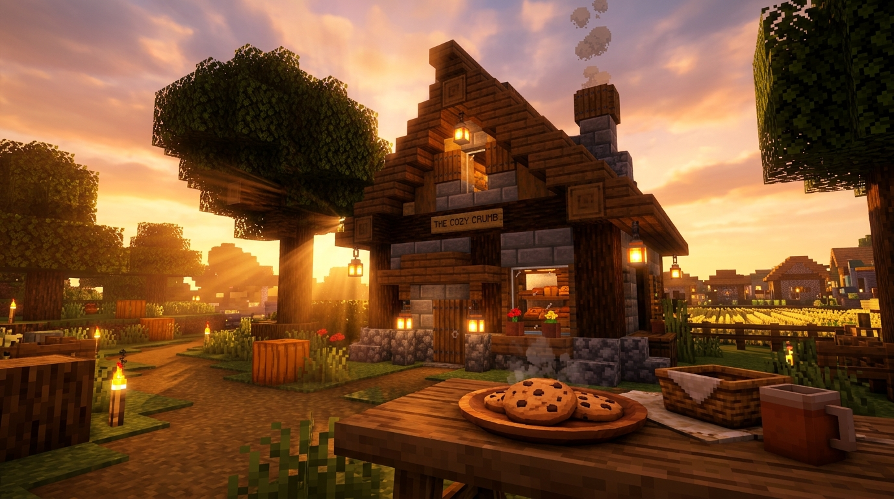
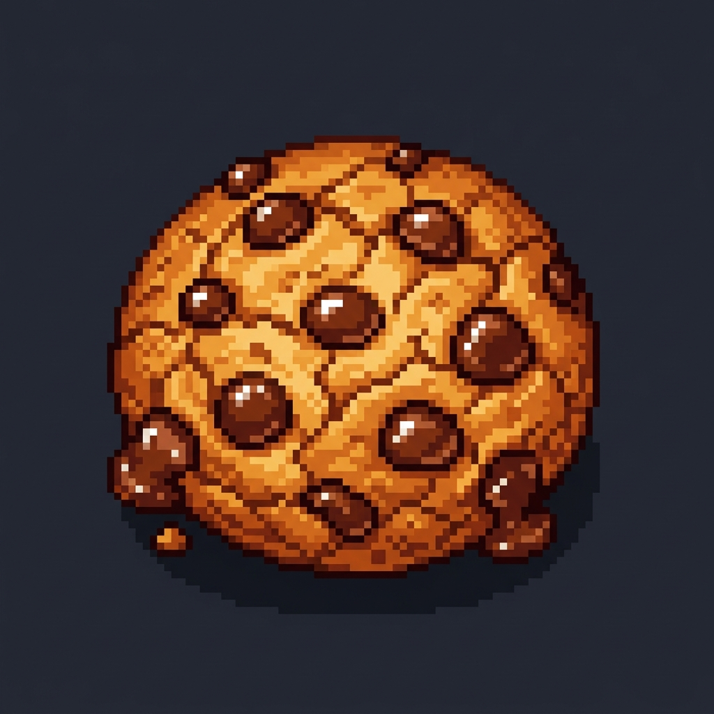

<!-- ================================================================= -->
<!-- 🍪 WELCOME TO COOKIE'S WARM BAKERY | GITHUB PROFILE README        -->
<!-- Designed with Cozy Bakery & Warm Minecraft Shader Aesthetic [10/10] -->
<!-- ================================================================= -->

<div align="center">
  <!-- Breathtaking Cinematic Minecraft Shader Sunset Banner -->
  <a href="https://github.com/LoveCookieee-java">
    
  </a>

  <br /><br />

  <!-- Cozy Bakery & Minecraft Badges Bar -->
  <p align="center">
    
    
    
    
    
  </p>
</div>

---

### ☕ Giới thiệu về Tiệm Bánh & Người Thợ Thủ Công

<table border="0" style="border: none;">
  <tr border="0">
    <td width="26%" align="center" style="border: none; vertical-align: middle;">
      <a href="https://github.com/LoveCookieee-java">
        
      </a>
      <br />
      <small><font color="#f59e0b"><b>🍪 HD Minecraft Pixel Cookie</b></font></small>
    </td>
    <td width="74%" style="border: none; vertical-align: middle; padding-left: 20px;">
      <p align="left">
        Chào mừng bạn ghé thăm tiệm bánh nhỏ ấm cúng của mình giữa thế giới mã nguồn! Mình là một <b>Giáo viên Tiếng Anh</b> yêu thích công nghệ, một <b>Backend &amp; AI/ML Engineer</b> say mê nghệ thuật lập trình và "vibe code". Mình luôn khao khát nhào nặn nên những sản phẩm thật chỉn chu, mang lại giá trị hữu ích và hỗ trợ cộng đồng hết mình. 🍪✨
      </p>
      <p align="left" style="color: #fde68a;">
        <i>"The best code is like a freshly baked cookie: clean ingredients, crafted with patience, and served with love."</i>
      </p>
    </td>
  </tr>
</table>

```yaml
baker_profile:
  name: LoveCookieee
  profession: English Teacher 📚
  engineering_craft: [Backend Engineer, AI/ML Engineer, Java Specialist]
  aesthetic_vibe: "Cozy Bakery at Sunset • Warm Minecraft Shaders 🌅"
  motto: "The best code is like a freshly baked cookie: clean ingredients, crafted with patience and love."

current_focus:
  - 🍪 Nướng những mẻ plugin & backend Java/Python mượt mà, tối ưu hiệu năng
  - 🧠 Nghiên cứu Autonomous AI Agents & tối ưu hóa nén bộ nhớ (CookieGli)
  - ⛏️ Kiến tạo thế giới Minecraft giàu cảm xúc (CookieDuel, CookiePortal, CookieDungeon)
  - 🛡️ Phát triển các giải pháp bảo mật và chống gian lận (AntiSpoofing)
  - 🤝 Lan tỏa niềm đam mê học hỏi, kết nối ngoại ngữ và tư duy lập trình
```

---

### 🌪️ Cơn Lốc Xoáy Quỹ Đạo Công Nghệ (The Ingredient Vortex Orbit)

<div align="center">
  <!-- Validated & High-Fidelity Animated Cosmic Tech Stack Vortex SVG -->
  
</div>

<br />

<details>
<summary><b>🧁 Nhấn để mở tủ gia vị & công nghệ chi tiết</b></summary>
<br />

| Kệ Bếp (Category) | Nguyên Liệu & Công Nghệ (Technologies) |
| :--- | :--- |
| **Lõi Ngôn ngữ (Core)** | `Java (Chuyên sâu ★★★★★)`, `Python`, `TypeScript`, `Rust`, `C++`, `C#` |
| **Giao diện & Web** | `React.js`, `JavaScript`, `HTML5 / CSS3`, `Responsive UI Components` |
| **Minecraft Platform** | `Spigot API`, `PaperMC`, `Bukkit`, `PySpigot Engine`, `SkriptLang`, `Packet Level / NMS` |
| **Môi trường & Công cụ** | `IntelliJ IDEA`, `VS Code`, `Git`, `Docker`, `Linux`, `Maven`, `Gradle` |

</details>

---

### 🧰 Hòm Đồ Tiệm Bánh (Minecraft Chest GUI & Project Lore)

<div align="center">
  <p><i>📦 <b>Container: Bakery Workshop Chest [Tier V]</b> — Chứa các vật phẩm &amp; công trình tâm đắc nhất:</i></p>

  <table border="0" style="border: 2px solid #542918; background-color: #1a1412; border-radius: 10px; width: 100%;">
    <tr>
      <td width="33%" align="center" style="padding: 12px; border: 1px solid #3d1d11; background-color: #231a16;">
        <b>🍪 [CookieGli]</b> <br />
        <small><font color="#f59e0b">★ Rarity: Mythic Artifact ★</font></small><br />
        <code>Stack: x64 | Python</code>
        <br /><br />
        <div align="left" style="font-size: 12px; color: #fde68a;">
          • <b>Công năng:</b> Nén toàn bộ mã nguồn repo thành genome ≤600 tokens.<br />
          • <b>Đặc tính:</b> Tiến hóa trí nhớ Darwinian với Bayesian Smoothed ROI cho AI Agent.
        </div>
        <br />
        <a href="https://github.com/LoveCookieee-java/CookieGli"><b>👉 Xem mã nguồn</b></a>
      </td>
      <td width="33%" align="center" style="padding: 12px; border: 1px solid #3d1d11; background-color: #231a16;">
        <b>⚔️ [CookieDuel]</b> <br />
        <small><font color="#38bdf8">★ Rarity: Legendary Weapon ★</font></small><br />
        <code>Stack: x1 | Java</code>
        <br /><br />
        <div align="left" style="font-size: 12px; color: #fde68a;">
          • <b>Công năng:</b> Hệ thống thách đấu PVP đỉnh cao cho Spigot.<br />
          • <b>Đặc tính:</b> Tích hợp 2 chế độ ghép trận: Wild RTP Queue &amp; PVP Arena Queue mượt mà.
        </div>
        <br />
        <a href="https://github.com/LoveCookieee-java/CookieDuel"><b>👉 Xem mã nguồn</b></a>
      </td>
      <td width="33%" align="center" style="padding: 12px; border: 1px solid #3d1d11; background-color: #231a16;">
        <b>🌀 [CookiePortal]</b> <br />
        <small><font color="#c084fc">★ Rarity: Epic Transport ★</font></small><br />
        <code>Stack: x16 | Java</code>
        <br /><br />
        <div align="left" style="font-size: 12px; color: #fde68a;">
          • <b>Công năng:</b> Đưa cơ chế cổng không gian Immersive Portal lên server.<br />
          • <b>Đặc tính:</b> Hoạt động 100% bằng plugin Spigot, người chơi không cần cài mod client.
        </div>
        <br />
        <a href="https://github.com/LoveCookieee-java/CookiePortal"><b>👉 Xem mã nguồn</b></a>
      </td>
    </tr>
    <tr>
      <td width="33%" align="center" style="padding: 12px; border: 1px solid #3d1d11; background-color: #231a16;">
        <b>🍳 [CookieCooking]</b> <br />
        <small><font color="#4ade80">★ Rarity: Culinary Magic ★</font></small><br />
        <code>Stack: x32 | Python</code>
        <br /><br />
        <div align="left" style="font-size: 12px; color: #fde68a;">
          • <b>Công năng:</b> Cơ chế nấu nướng ẩm thực tương tác trên PySpigot.<br />
          • <b>Đặc tính:</b> Công thức thủ công, hiệu ứng nướng bánh và buff chỉ số người chơi.
        </div>
        <br />
        <a href="https://github.com/LoveCookieee-java/CookieCooking"><b>👉 Xem mã nguồn</b></a>
      </td>
      <td width="33%" align="center" style="padding: 12px; border: 1px solid #3d1d11; background-color: #231a16;">
        <b>🛡️ [AntiSpoofing]</b> <br />
        <small><font color="#f87171">★ Rarity: Ancient Defense ★</font></small><br />
        <code>Stack: x1 | Java / Security</code>
        <br /><br />
        <div align="left" style="font-size: 12px; color: #fde68a;">
          • <b>Công năng:</b> Tường lửa phòng thủ mạng và bảo mật gói tin.<br />
          • <b>Đặc tính:</b> Giám sát packet level, chặn giả mạo danh tính và can thiệp trái phép.
        </div>
        <br />
        <font color="#f59e0b"><i>♨️ Đang trong lò nướng (Dev)</i></font>
      </td>
      <td width="33%" align="center" style="padding: 12px; border: 1px solid #3d1d11; background-color: #231a16;">
        <b>🏰 [CookieDungeon]</b> <br />
        <small><font color="#fbbf24">★ Rarity: Master Key ★</font></small><br />
        <code>Stack: x3 | Minecraft RPG</code>
        <br /><br />
        <div align="left" style="font-size: 12px; color: #fde68a;">
          • <b>Công năng:</b> Hệ thống hầm ngục thủ công phong phú, cơ chế Boss.<br />
          • <b>Đặc tính:</b> Lối chơi chiến thuật theo tổ đội và phần thưởng ngẫu nhiên.
        </div>
        <br />
        <font color="#f59e0b"><i>♨️ Đang trong lò nướng (Dev)</i></font>
      </td>
    </tr>
  </table>
</div>

---

### 📊 Bảng Thống Kê Tiệm Bánh (Bakery Telemetry Matrix)

<div align="center">
  <table border="0" style="border: none;">
    <tr border="0">
      <td width="50%" align="center" style="border: none;">
        <a href="https://github.com/LoveCookieee-java">
          
        </a>
      </td>
      <td width="50%" align="center" style="border: none;">
        <a href="https://github.com/LoveCookieee-java">
          
        </a>
      </td>
    </tr>
    <tr border="0">
      <td width="50%" align="center" style="border: none;">
        <a href="https://github.com/LoveCookieee-java">
          
        </a>
      </td>
      <td width="50%" align="center" style="border: none;">
        <a href="https://github.com/LoveCookieee-java">
          
        </a>
      </td>
    </tr>
  </table>
</div>

---

### 🧱 Bản Đồ Đóng Góp 3D Minecraft (3D Voxel Contribution Blocks)

<div align="center">
  <p><i>Mỗi commit tương ứng với một khối lập phương Isometric 3D vươn cao như một pháo đài Minecraft:</i></p>
  <!-- Generated automatically by GitHub Action (.github/workflows/profile-3d.yml) -->
  <picture>
    <source media="(prefers-color-scheme: dark)" srcset="./profile-3d-contrib/profile-gitblock.svg">
    <source media="(prefers-color-scheme: light)" srcset="./profile-3d-contrib/profile-gitblock.svg">
    
  </picture>
</div>

---

### 🐍 Rắn Săn Mẩu Bánh Quy (Bakery Contribution Snake)

<div align="center">
  <!-- Automatically generated by GitHub Actions (.github/workflows/snake.yml) -->
  <picture>
    <source media="(prefers-color-scheme: dark)" srcset="https://raw.githubusercontent.com/LoveCookieee-java/LoveCookieee-java/output/github-contribution-grid-snake-dark.svg">
    <source media="(prefers-color-scheme: light)" srcset="https://raw.githubusercontent.com/LoveCookieee-java/LoveCookieee-java/output/github-contribution-grid-snake.svg">
    
  </picture>
</div>

---

### 💡 Mẩu Bánh Trí Tuệ Mỗi Ngày (Daily Warmth & Wisdom)

<!--START_SECTION:quote-->
<p align="center">
  
</p>
<!--END_SECTION:quote-->

---

### 🍵 Kết Nối & Thưởng Trà Cùng Thợ Bánh

<div align="center">
  <a href="https://discord.gg/vcfHaTVKmZ" target="_blank">
    
  </a>
  &nbsp;
  <a href="https://facebook.com" target="_blank">
    
  </a>
  &nbsp;
  <a href="https://threads.net" target="_blank">
    
  </a>
  &nbsp;
  <a href="https://github.com/LoveCookieee-java" target="_blank">
    
  </a>

  <br /><br />
  <p><i>☕ Ghé thăm server Discord <b><a href="https://discord.gg/vcfHaTVKmZ">Cookie Community</a></b> để cùng đàm đạo về Minecraft Plugin, AI Agents, chia sẻ dự án hoặc cùng học Tiếng Anh nhé!</i></p>
</div>

<br />

<!-- Warm Minecraft Sunset Waving Footer -->
<div align="center">
  
</div>
